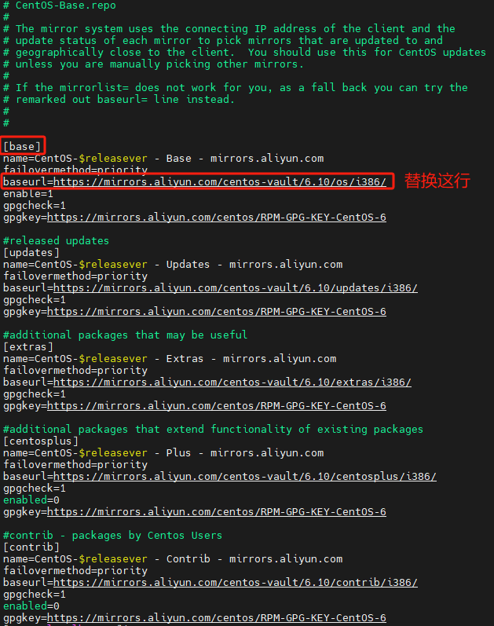

# CentOS 6.10更换阿里云的yum源

##  一、备份源文件

```bash
cp /etc/yum.repos.d/CentOS-Base.repo /etc/yum.repos.d/CentOS-Base.repo.bak
```

##  编辑 /etc/yum.repos.d/CentOS-Base.repo文件

```bash
vim /etc/yum.repos.d/CentOS-Base.repo
```

## 替换[base]下baseurl地址为：

```bash
baseurl=https://mirrors.aliyun.com/centosvault/6.10/os/i386/
```




## 版权说明

感谢 IT 天空、系统总裁相关项目支持。
若内容 / 软件涉及侵权，请联系作者删除。
邮箱：[admin@mocos\.cn](mailto:admin@mocos.cn)
QQ：1474922147

Copyright © 2017\-2026\[魔客室\] All rights reserved\.
