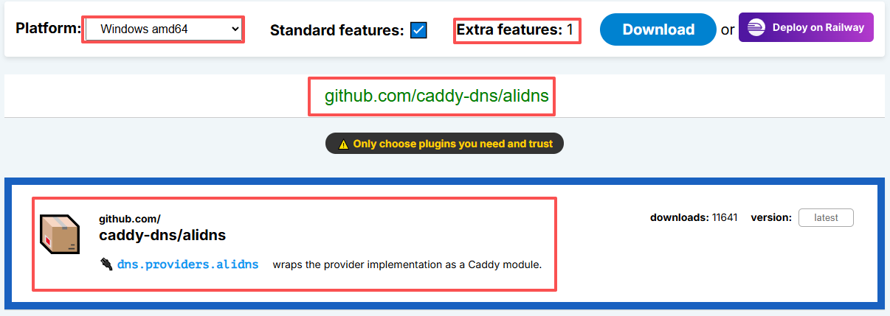

# 目录

- [[#一、Quartz 静态站点搭建]]
  - [[#1.1 环境准备]]
  - [[#1.2 下载并初始化 Quartz]]
  - [[#1.3 本地预览与构建]]
  - [[#1.4 Obsidian 配置优化]]
  - [[#1.5 内容结构规划]]
- [[#二、Nginx 部署静态站点]]
	- [[#2.1 🐧Linux版安装]]
		-  [[#2.1.1 下载与安装]]
		- [[# 2.1.2 Linux版静态站点配置]]
			- [[# 2.1.2.1 站点创建]]
			- [[# 2.1.2.2  基础配置]] 
			- [[# 2.1.2.3 性能优化配置]]
			- [[# 2.1.2.4 防火墙放行相应端口]]
	- [[#2.2 💻Windows版安装]]
		- [[# 2.2.1下载与安装]]
		- [[# 2.2.2 Windows版静态站点配置]]
			- [[# 2.2.2.1 站点创建]]
			- [[# 2.2.2.2 基础配置]]
- [[#三、Caddy 部署静态站点]]
  - [[#3.1 Caddy 安装]]
	-  [[# 3.1.1 Linux安装]]
	-  [[# 3.1.2 Windows 安装]]
  - [[#3.2 Caddyfile 基础配置]]
	- [[# 3.2.1Linux配置]]
		-  [[# 3.2.1.1基础静态站点配置]]
		-  [[# 3.2.1.2高级配置与优化]]
	- [[# 3.2.2 Windows配置]]
		-  [[#3.2.2.1 基础静态站点配置]]
		-  [[#3.2.2.2 高级配置与优化]]
- [[#四、阿里云 ESA 解决端口封禁]]
  - [[#4.1 原理说明]]
  - [[#4.2 开通 ESA 服务]]
  - [[#4.3 添加站点配置]]
  - [[#4.4 DNS 解析配置]]
  - [[#4.5 回源规则配置]]
  - [[#4.6 SSL 证书配置]]
  - [[#4.7 验证与测试]]
- [[#五、完整部署流程汇总]]
	- [[# 5.1 整体架构图]]
	- [[# 5.2 快速部署 Checklist]]
	- [[# 5.3 自动化部署脚本示例]]
- [[#六、常见问题与排错]]
	- [[# 6.1 Quartz 相关问题]]
	- [[# 6.2 Nginx/Caddy 相关问题]]
	- [[# 6.3 阿里云 ESA 相关问题]]
	- [[# 6.4 端口封禁排查]]

---

# 一、Quartz 静态站点搭建

## 1.1 环境准备

Quartz 是基于 Node.js 的静态站点生成器，专为 Obsidian 笔记发布设计，原生支持双链语法。

**必需环境：**
- Git：版本控制与代码同步
- Node.js：运行 Quartz 构建
- npm：包管理工具（Node.js 自带）
- Obsidian：笔记编辑

**安装 Git：**
```bash
# Ubuntu/Debian
sudo apt update && sudo apt install git -y

# 配置 Git
git config --global user.name "你的用户名"
git config --global user.email "你的邮箱"

# 验证安装
git --version
```

**安装 Node.js（推荐 LTS 版本）：**
```bash
# Ubuntu/Debian 使用 NodeSource 仓库
curl -fsSL https://deb.nodesource.com/setup_lts.x | sudo -E bash -
sudo apt install -y nodejs

# 验证安装
node -v
npm -v
```

## 1.2 下载并初始化 Quartz

**克隆 Quartz 仓库：**
```bash
# 创建项目目录并克隆
git clone https://github.com/jackyzha0/quartz.git my-quartz-site
cd my-quartz-site
```

> 💡 **网络问题解决**：如果克隆失败，可尝试设置 Git 使用 HTTP/1.1
> ```bash
> git config --global http.version HTTP/1.1
> git clone --depth=1 https://github.com/jackyzha0/quartz.git my-quartz-site
> ```

**安装依赖：**
```bash
npm i
```

**初始化 Quartz：**
```bash
npx quartz create
```

初始化选项说明：
1. **Choose how to initialize the content** → 选择 `Empty Quartz`（空项目）
2. **Choose how Quartz should resolve links in your content** → 选择 `Treat links as shortest path`（适配 Obsidian 双链）
3. 其他选项保持默认，按回车即可

## 1.3 本地预览与构建

**本地开发预览：**
```bash
npx quartz build --serve
```

启动成功后会显示：
```
Started a Quartz server listening at http://localhost:8080
```

浏览器访问 `http://localhost:8080` 即可预览站点。

> ⚠️ 停止服务：在终端按 `Ctrl + C`

**生产环境构建：**
```bash
npx quartz build
```

构建完成后，静态文件输出到 `public/` 目录，这就是我们需要部署的内容。

## 1.4 Obsidian 配置优化

**打开项目文件夹：**
在 Obsidian 中选择「打开本地文件夹作为仓库」，选择整个 `my-quartz-site` 目录（不要只选 content）。

**隐藏不必要的文件：**
进入 `设置 → 文件与链接 → 排除文件`，添加以下内容：
```
node_modules/
quartz/
public/
.github/
.git/
package.json
package-lock.json
quartz.config.ts
quartz.layout.ts
tsconfig.json
```

**设置图片保存位置：**
进入 `设置 → 文件与链接`，找到「附件默认存放位置」：
- 选择：`指定的附件文件夹`
- 子文件夹名称：`content/assets`

**设置新建笔记默认位置：**
进入 `设置 → 文件与链接`，找到「新建笔记的存放位置」：
- 选择：`指定的文件夹`
- 文件夹：`content`

## 1.5 内容结构规划

**推荐目录结构：**
```
content/
├── index.md              # 首页
├── assets/               # 图片资源             
├── 教程/
│   ├── index.md          # 分类首页
│   ├── Quartz搭建指南.md
├── 运维/
│   ├── index.md
│   ├── Nginx配置详解.md
└── 工具/
    ├── index.md
    └── ...
```

**首页示例（content/index.md）：**
```markdown
---
title: 首页

description: 我的技术笔记与知识花园
---


# 欢迎来到我的知识花园

这里是我的公开笔记博客，记录技术学习与实践总结。

## 内容分类

- [[教程/index|教程笔记]]
- [[运维/index|运维实践]]
- [[工具/index|工具推荐]]

## 最近更新

- [[教程/Quartz搭建指南]]
- [[运维/Nginx配置详解]]
```

**分类首页示例（content/教程/index.md）：**
```markdown
---
title: 教程笔记
description: 各类技术教程与操作指南
tags:
  - 教程
---

# 教程笔记

这里整理各类技术教程与详细操作指南。

## 站点搭建

- [[Quartz搭建指南]]
- [[Obsidian使用技巧]]

## 服务器运维

- [[Nginx配置详解]]
- [[Caddy快速入门]]
```

---

# 二、Nginx 部署静态站点


## 2.1 🐧Linux版安装

### 2.1.1 下载与安装
**Ubuntu/Debian 安装：**
```bash
sudo apt update && sudo apt install nginx -y

# 启动并设置开机自启
sudo systemctl enable --now nginx

# 验证安装
curl -I http://localhost
```

**CentOS/RHEL 安装：**
```bash
sudo yum install nginx -y
sudo systemctl enable --now nginx
```

**Nginx 核心目录：**
```
|              路径           |          说明         |
|-----------------------------|-----------------------|
| /etc/nginx/nginx.conf       | 主配置文件             |
| /etc/nginx/conf.d/*.conf    | 站点配置目录           |
| /etc/nginx/sites-available/ | 站点配置存放(Ubuntu)   |
| /etc/nginx/sites-enabled/   | 已激活站点(软链接)      |
| /var/log/nginx/access.log   | 访问日志               |
| /var/log/nginx/error.log    | 错误日志               |
```

### 2.1.2 Linux版静态站点配置
#### 2.1.2.1 站点创建
**创建站点根目录：**
```bash
# 创建网站目录
sudo mkdir -p /var/www/quartz-site

# 上传 Quartz 构建产物（public 目录内容）
# 假设本地构建好的 public 目录在 /tmp/public
sudo cp -r /tmp/public/* /var/www/quartz-site/

# 设置权限
sudo chown -R www-data:www-data /var/www/quartz-site
```

**创建 Nginx 配置文件：**
```bash
sudo nano /etc/nginx/conf.d/quartz-site.conf
```

#### 2.1.2.2  基础配置
##### HTTP配置：

**（/etc/nginx/conf.d/quartz-site.conf）**
```nginx
server {
    listen 80;
    listen [::]:80;
    server_name example.com www.example.com;

    root /var/www/quartz-site;
    index index.html;

    # 日志
    access_log /var/log/nginx/quartz-access.log;
    error_log /var/log/nginx/quartz-error.log warn;

    # 静态文件处理
    location / {
        try_files $uri $uri/ =404;
    }

    # 静态资源缓存
    location ~* \.(jpg|jpeg|png|gif|ico|css|js|woff2|svg|woff|ttf)$ {
        expires 30d;
        add_header Cache-Control "public, immutable";
    }

    # 禁止访问隐藏文件
    location ~ /\. {
        deny all;
        access_log off;
        log_not_found off;
    }
}
```

##### HTTPS配置

###### 使用Certbot

 **1、申请证书：**
```bash
# 安装 Certbot
sudo apt install certbot python3-certbot-nginx -y

# 申请并自动配置证书
sudo certbot --nginx -d example.com -d www.example.com
```

**2、手动 HTTPS 配置：**
```nginx
# HTTP 重定向到 HTTPS
server {
    listen 80;
    listen [::]:80;
    server_name example.com www.example.com;
    return 301 https://$host$request_uri;
}

# HTTPS 站点
server {
    listen 443 ssl http2;
    listen [::]:443 ssl http2;
    server_name example.com www.example.com;

    root /var/www/quartz-site;
    index index.html;

    # SSL 证书路径
    ssl_certificate /etc/letsencrypt/live/example.com/fullchain.pem;
    ssl_certificate_key /etc/letsencrypt/live/example.com/privkey.pem;

    # SSL 安全配置
    ssl_protocols TLSv1.2 TLSv1.3;
    ssl_ciphers ECDHE-ECDSA-AES128-GCM-SHA256:ECDHE-RSA-AES128-GCM-SHA256:ECDHE-ECDSA-AES256-GCM-SHA384:ECDHE-RSA-AES256-GCM-SHA384;
    ssl_prefer_server_ciphers off;

    # HSTS
    add_header Strict-Transport-Security "max-age=63072000" always;

    # 其他配置同 HTTP 版本...
}
```

> 💡 如果使用阿里云 ESA，HTTPS 可由 ESA 边缘节点处理，源站可只用 HTTP。如需源站直接 HTTPS，可参考以下配置。

###### 使用 acme.sh DNS（阿里云 DNS）

**1、申请阿里云API密钥**

进入阿里云控制台：https://home.console.aliyun.com/home/dashboard/ProductAndService

搜索**访问控制RAM---身份管理---用户---创建用户**，根据页面提示填好相关信息。

勾选**使用永久AccessKey访问**，考虑安全也可以选择其他方式，点击确定后完成创建。

在创建好的账号下点击**新增权限**，在**权限策略**搜索**AliyunDNSFullAccess**，**确认新增权限**保存。

再次点击新增的用户进入**凭证管理---创建AccessKey**根据提示完成创建后**即时保存在安全位置**。

**避免信息泄露，同时页面信息只显示一次，关闭当前网页就无法找回，谨记！！！**


**2、安装 acme.sh：**
```bash
# Linux 
curl https://get.acme.sh | sh 
source ~/.bashrc
```

**3、配置阿里云 API 密钥（DNS 验证）：**
```bash
export Ali_Key="你的AccessKeyID" 
export Ali_Secret="你的AccessKeySecret"
```

**4、签发泛域名证书：**
```bash
acme.sh --issue --dns dns_ali -d example.com -d *.example.com
```


5、**验证并生效配置：**
```bash
# 检查配置语法
sudo nginx -t

# 重载配置
sudo systemctl reload nginx
```

#### 2.1.2.3 性能优化配置

**全局优化**
**（/etc/nginx/nginx.conf）：**
```nginx
worker_processes auto;
worker_rlimit_nofile 65535;

events {
    worker_connections 4096;
    multi_accept on;
    use epoll;
}

http {
    server_tokens off;

    # 连接优化
    keepalive_timeout 65;
    keepalive_requests 1000;

    # Gzip 压缩
    gzip on;
    gzip_vary on;
    gzip_proxied any;
    gzip_comp_level 6;
    gzip_min_length 1000;
    gzip_types
        text/plain text/css text/xml text/javascript
        application/json application/javascript application/xml
        application/x-font-ttf font/opentype image/svg+xml;

    # 文件缓存
    open_file_cache max=10000 inactive=30s;
    open_file_cache_valid 60s;
    open_file_cache_min_uses 2;

    include /etc/nginx/conf.d/*.conf;
}
```

#### 2.1.2.4 防火墙放行相应端口
##### CentOS 7+/RockyLinux/AlmaLinux/RHEL — firewalld

**1、临时开放（重启失效）**
``` bash
# 放行TCP 80端口 
firewall-cmd --add-port=80/tcp 
# 放行多端口 
firewall-cmd --add-port=80/tcp --add-port=443/tcp
```

**2、永久开放（推荐）**
```bash
firewall-cmd --add-port=80/tcp --permanent 
# 多个端口写法 
firewall-cmd --add-port={80,443,5443}/tcp --permanent 
# 放行UDP端口示例 
firewall-cmd --add-port=500/udp --permanent 
# 重载生效（必须执行） 
firewall-cmd --reload

```

**3. 放行指定 IP 访问端口（限制来源 IP）**
```bash
firewall-cmd --add-rich-rule='rule family="ipv4" source address="192.168.1.0/24" port protocol="tcp" port="22" accept' --permanent
# 放行指定IP访问端口

firewall-cmd --reload
```

**4、常用查询**
```bash
# 查看放行端口 
firewall-cmd --list-ports 
# 查看所有规则 
firewall-cmd --list-all
```

**5、删除端口规则**
```bash
firewall-cmd --remove-port=80/tcp --permanent
firewall-cmd --reload
```

##### Ubuntu / Debian - UFW (简易防火墙)

**系统默认不一定开启**
```bash
# 启用ufw 

ufw enable 
# 放行tcp 80端口 
ufw allow 80/tcp 
# 放行多个端口 
ufw allow 443/tcp ufw allow 5443/tcp
 
# 放行一段端口 1000-2000 TCP 
ufw allow 1000:2000/tcp
 
# 仅允许指定IP访问端口 
ufw allow from 192.168.1.0/24 to any port 22 proto tcp
 
# 删除规则 
ufw delete allow 80/tcp
 
# 查看规则 
ufw status numbered 
# 重载无需额外命令，配置即时生效
```

##### 通用底层：iptables（老旧系统、自定义环境）#####

**⚠️ iptables 规则默认内存生效，重启丢失，需要安装工具保存（iptables-services/netfilter-persistent）**
```bash
# 放行入站TCP 80 
iptables -A INPUT -p tcp --dport 80 -j ACCEPT 
# 放行udp iptables -A INPUT -p udp --dport 500 -j ACCEPT 
# 限制来源IP 
iptables -A INPUT -s 192.168.1.0/24 -p tcp --dport 22 -j ACCEPT
```

**保存 iptables 规则**

CentOS：`service iptables save`

Debian/Ubuntu：`netfilter-persistent save`

##### Debian11+/Ubuntu22+/Rocky 新版 — nftables（替代 iptables）

**直接命令**

```bash
nft add rule inet filter input tcp dport 80 accept
```

持久化需要写入 `/etc/nftables.conf`

##### 阿里云 / 腾讯云服务器额外提醒！

**系统防火墙放行端口≠能公网访问**

还需要在云服务商控制台：**安全组放行对应端口**，否则外部依然无法连通。


## 2.2 💻Windows版安装
### 2.2.1下载与安装

打开网址：
https://nginx.org/en/download.html

选择对应的Windows版本下载,如: nginx/Windows-1.31.3  pgp

下面是示例版本链接：
https://nginx.org/download/nginx-1.31.3.zip

将下载的压缩包解压到相应的目录，最好是根目录，如选其他目录最好避免有中文路径，
解压缩后确保文件完整无误。


### 2.2.2 Windows版静态站点配置

##### 2.2.2.1 站点创建：
将下载的nginx压缩包解压并把HTML网站文件复制到解压后的html文件夹里，这里以C盘下nginx文件夹为例。

**目录结构如下：**
```
C:\nginx\conf\
    mime.types
    ......
    nginx.conf     这是nginx的配置文件
C:\nginx\contrib\
C:\nginx\docs\
C:\nginx\html\     这是放站点HTML文件的目录
    index.html
    ...
    xxxxx.html     HTML网页文件
C:\nginx\logs\        
C:\nginx\temp\ 
C:\nginx\nginx.exe 主程序
```

##### 2.2.2.2 基础配置
###### HTTP配置（C:\nginx\conf\nginx.conf）：
```nginx
#user  nobody;
worker_processes  1;
#error_log  logs/error.log;
#error_log  logs/error.log  notice;
#error_log  logs/error.log  info;
#pid        logs/nginx.pid;
events {
    worker_connections  1024;
}

http {
    include       mime.types;
    default_type  application/octet-stream;
    #log_format  main  '$remote_addr - $remote_user [$time_local] "$request" '
    #                  '$status $body_bytes_sent "$http_referer" '
    #                  '"$http_user_agent" "$http_x_forwarded_for"';
    #access_log  logs/access.log  main;
    sendfile        on;
    #tcp_nopush     on;
    #keepalive_timeout  0;
    keepalive_timeout  65;
    #gzip  on;
    server {
        listen       8010;     #设置本地服务器监听端口
        server_name  localhost;    # 或自定义域名如：example.com
        #access_log  logs/host.access.log  main;
        location / {
            root   html;    #网站根目录，即在当前根目录下nginx的html目录下
            index  index.html;     #网站首页文件
            try_files $uri $uri.html $uri/ /index.html;    
            #SPA路由设置，obsidian必须设置，不然网页无法跳转
            charset utf-8;   #字符集
        }
			# 静态资源缓存
    location ~* \.(js|css|png|jpg|jpeg|gif|ico|svg|woff|woff2|ttf)$ {
        expires 30d;
        add_header Cache-Control "public, no-transform";
			}
			# 禁止访问隐藏文件
    location ~ /\. {
        deny all;
    }
		    # 开启压缩
			gzip on;
    gzip_types text/plain text/css application/json application/javascript text/xml application/xml+rss text/javascript;


        #error_page  404              /404.html;
        # redirect server error pages to the static page /50x.html
        #
        error_page   500 502 503 504  /50x.html;
        location = /50x.html {
            root   html;
        }
        # proxy the PHP scripts to Apache listening on 127.0.0.1:80
        #
        #location ~ \.php$ {
        #    proxy_pass   http://127.0.0.1;
        #}
        # pass the PHP scripts to FastCGI server listening on 127.0.0.1:9000
        #
        #location ~ \.php$ {
        #    root           html;
        #    fastcgi_pass   127.0.0.1:9000;
        #    fastcgi_index  index.php;
        #    fastcgi_param  SCRIPT_FILENAME  /scripts$fastcgi_script_name;
        #    include        fastcgi_params;
        #}
        # deny access to .htaccess files, if Apache's document root
        # concurs with nginx's one
        #
        #location ~ /\.ht {
        #    deny  all;
        #}
    }

    # another virtual host using mix of IP-, name-, and port-based configuration
    #
    #server {
    #    listen       8000;
    #    listen       somename:8080;
    #    server_name  somename  alias  another.alias;
    #    location / {
    #        root   html;
    #        index  index.html index.htm;
    #    }
    #}

    # HTTPS server
    #
    #server {
    #    listen       443 ssl;
    #    server_name  localhost;
    #    ssl_certificate      cert.pem;
    #    ssl_certificate_key  cert.key;
    #    ssl_session_cache    shared:SSL:1m;
    #    ssl_session_timeout  5m;
    #    ssl_ciphers  HIGH:!aNULL:!MD5;
    #    ssl_prefer_server_ciphers  on;
    #    location / {
    #        root   html;
    #        index  index.html index.htm;
    #    }
    #}
}

```

###### HTTPS配置

- **1、Win-ACME证书**

**目录规划（推荐）**

```text
D:/ ├── nginx/              # Nginx 安装目录 
    │   ├── nginx.exe 
    │   └── conf/ 
    │       └── nginx.conf 
    ├── ssl/                # 证书存放目录 
    │   └── example.com/ 
    │       ├── fullchain.pem 
    │       └── privkey.pem 
    ├── quartz_build/       # Quartz 静态站点 
    │   ├── index.html 
    │   └── ... 
    └── win-acme/           # Win-ACME 工具目录 
	    └── wacs.exe
```


**下载安装**

官方下载地址：
[https://github.com/win-acme/win-acme/releases](https://link.wtturl.cn/?target=https%3A%2F%2Fgithub.com%2Fwin-acme%2Fwin-acme%2Freleases&scene=im&aid=582478&lang=zh)

下载选择：

- 选择 `win-acme.v2.x.x.x.x64.trimmed.zip`（精简版，够用）
- 解压到 `D:/win-acme/`

 **准备阿里云 AccessKey**

**步骤：**

1. 登录阿里云控制台
2. 进入「访问控制 RAM」→「用户」
3. 创建新用户，勾选「OpenAPI 访问」
4. 授权策略：`AliyunDNSFullAccess`（仅 DNS 管理权限，遵循最小权限原则）
5. 保存 AccessKey ID 和 AccessKey Secret

> ⚠️ **安全提醒：**
> 
> - 不要使用主账号 AccessKey
> - 专门创建一个仅用于 DNS 管理的 RAM 子用户
> - 密钥不要提交到代码仓库

**交互式申请证书（图形化）**

**运行 wacs.exe：**

1. 右键「以管理员身份运行」`wacs.exe`
2. 主菜单选择 `N` → Create new certificate
3. 选择 `2` → Manually input
4. 输入域名：`mocos.cn,*.mocos.cn`
5. 选择验证方式：`dns-01`
6. 选择 DNS 服务商：`aliyun`
7. 输入 AccessKey ID 和 Secret
8. 选择存储方式：`PEM encoded files`
9. 指定证书输出路径：`D:/ssl/mocos.cn/`
10. 选择安装步骤：`None`（我们手动配置 Nginx）
11. 添加「证书更新后执行脚本」
    
    - 脚本路径：`D:/nginx/nginx.exe`
    - 参数：`-s reload`
    
12. 确认并申请

> ✅ 申请成功后，证书会自动保存到 `D:/ssl/mocos.cn/` 目录

**命令行一键申请（推荐）**

打开 PowerShell（管理员），执行：
```powershell
# 进入 Win-ACME 目录 
cd D:/win-acme 
# 一键申请证书 
.\wacs.exe ` 
--source manual ` 
--host "example.com,*.example.com" ` 
--validation dns-01 ` 
--validationmode dns-01 ` 
--dns-script aliyun ` 
--dnsscope "example.com" ` 
--store pemfiles ` 
--pemfilespath "D:/ssl/example.com" ` 
--installation script ` 
--script "D:/nginx/nginx.exe" ` 
--scriptparameters "-s reload" ` 
--accepttos
```

**参数说明：**

| 参数                      | 说明                     |
| ----------------------- | ---------------------- |
| `--source manual`       | 手动输入域名                 |
| `--host`                | 申请的域名列表，逗号分隔           |
| `--validation dns-01`   | 使用 DNS-01 验证（无需 80 端口） |
| `--dns-script aliyun`   | 使用阿里云 DNS 插件           |
| `--store pemfiles`      | 输出 PEM 格式证书（Nginx 适用）  |
| `--pemfilespath`        | 证书输出目录                 |
| `--installation script` | 证书更新后执行脚本              |
| `--script`              | 脚本 / 程序路径              |
| `--scriptparameters`    | 脚本参数（重载 Nginx）         |
**证书自动续期与 Nginx 重载**

Win-ACME 安装后会自动创建：

- **Windows 计划任务**：每天自动检查证书是否需要续期
- **续期触发条件**：证书有效期剩余 < 30 天时自动续期
- **续期成功后**：自动执行配置的脚本（重载 Nginx）

查看计划任务：

```powershell
# 打开任务计划程序
taskschd.msc
# 找到：win-acme renew (acme-v2)
```

**配置重载脚本**

**方式一：Win-ACME 申请时直接配置（推荐）**

在申请证书时添加：

```plaintext
--installation script
--script "D:/nginx/nginx.exe"
--scriptparameters "-s reload"
```

**方式二：手动编写 bat 脚本**

创建 `D:/ssl/reload-nginx.bat`：

```batch
@echo off
cd /d D:/nginx
nginx.exe -s reload
echo %date% %time% Nginx reloaded >> D:/ssl/renew.log
```

然后在 Win-ACME 中配置脚本路径为 `D:/ssl/reload-nginx.bat`


**强制续期测试（验证流程是否正常）：**

```powershell
cd D:/win-acme
.\wacs.exe --renew --force
```

**查看证书有效期：**

```powershell
# 查看证书信息
certutil -dump D:/ssl/example.com/fullchain.pem
```


**nginx证书配置** `D:/nginx/conf/nginx.conf`

```nginx
# HTTPS server
server {
	listen 443 ssl;   # 如果不能用，改为下面自定义端口
	listen 8443 ssl;  # 自定义端口
	server_name example.com www.example.com;   # 本地测试填写localhost
	# 或者填写阿里云ESA提供的CNAME域名
	ssl_certificate      D:/ssl/example.com/fullchain.cer;
	ssl_certificate_key  D:/ssl/example.com/example.com.key;
	
	# SSL 安全配置 
	ssl_protocols TLSv1.2 TLSv1.3; 
	ssl_ciphers ECDHE-ECDSA-AES128-GCM-SHA256:ECDHE-RSA-AES128-GCM-SHA256:ECDHE-ECDSA-AES256-GCM-SHA384:ECDHE-RSA-AES256-GCM-SHA384; 
	ssl_prefer_server_ciphers off; 
	ssl_session_cache shared:SSL:10m; 
	ssl_session_timeout 10m;
	
	
	root D:/quartz_build;   # 全局静态目录，所有location共享
	index index.html;   # 首页文件
	
	# 日志 
	access_log  D:/nginx/logs/quartz-access.log; 
	error_log   D:/nginx/logs/quartz-error.log warn;
	
	# Quartz SPA路由核心 解决：页面刷新 404 问题
	location / {
		try_files $uri $uri.html $uri/ /index.html; 
		# $uri→请求同名没有后缀的文件， $uri→请求同名.html的文件， $uti/→请求同名的目录
		charset utf-8;   #字符集
	}
	# 静态资源缓存，这里自动继承上方root，不会404
    location ~* \.(js|css|png|jpg|svg|gif|ico|webp)$ {
        expires 30d;
        add_header Cache-Control "public，immutable";
    }
    
    # ---------- 安全头 ---------- 
    add_header X-Content-Type-Options "nosniff" always; 
    add_header X-Frame-Options "SAMEORIGIN" always; 
    add_header Referrer-Policy "strict-origin-when-cross-origin" always;
    
    
    # 禁止访问隐藏文件
    location ~ /\. {
        deny all;
    }   
			# 开启压缩		
			gzip on;
	gzip_types text/plain text/css application/json application/javascript text/xml application/xml+rss text/javascript; 
	
    
		error_page   500 502 503 504  /50x.html;
        location = /50x.html {
            root   html;
        } 
    
}

```

**try_files 详解（Quartz 必看）**

```nginx
try_files $uri $uri.html $uri/ /index.html;
```

**按顺序查找：**

1. `$uri` → 精确匹配文件（如 `/notes/index`）
2. `$uri.html` → 自动补 .html 后缀（Quartz 生成的静态页）
3. `$uri/` → 匹配目录，找目录下的 index.html
4. `/index.html` → 都找不到，交给 SPA 路由（兜底）

> 🎯 **核心：** `$uri.html` 是解决 Quartz 路由问题的关键，很多教程漏掉这一项导致刷新 404。

**验证并生效配置：**
```cmd
# 打开 CMD，进入 nginx 目录
cd /d D:/nginx

# 检查配置语法
nginx -t

# 启动 Nginx 
start nginx

# 查看进程 
tasklist | findstr nginx

# 停止 Nginx 
nginx -s stop

# 重载配置
nginx -s reload
```


**阿里云ESA边缘节点**

> 💡 如果使用阿里云 ESA，HTTPS 可由 ESA 边缘节点处理，源站可只用 HTTP。如需源站直接 HTTPS，可参考以上配置，下面是具体细节。

推荐目录结构：

```plaintext
D:/ 
├── nginx/                   # Nginx 程序目录 
│   ├── nginx.exe 
│   ├── conf/ 
│   │   ├── nginx.conf       # 主配置 
│   │   └── conf.d/ 
│   │   └── quartz.conf      # 站点配置 
│   └── logs/ 
├── ssl/                     # 证书目录 
│   └── mocos.cn/ 
│       ├── fullchain.pem 
│       └── privkey.pem 
├── quartz_build/            # Quartz 静态站点 
│   ├── index.html 
│   ├── assets/ 
│   └── ... 
└── win-acme/                # Win-ACME 工具 
    └── wacs.exe
```

第一步：修改主配置 `nginx.conf`

```nginx
# 文件：D:/nginx/conf/nginx.conf 
worker_processes auto; 
events { 
	worker_connections 1024;
	 } 
http { 
	include mime.types; 
	default_type application/octet-stream; 
	# 日志格式 
	log_format main '$remote_addr - $remote_user [$time_local] "$request" ' 
	                '$status $body_bytes_sent "$http_referer" ' 
	                '"$http_user_agent" "$http_x_forwarded_for"'; 
	sendfile on; 
	keepalive_timeout 65; 
	# Gzip 压缩 
	gzip on; 
	gzip_vary on; 
	gzip_min_length 1024; 
	gzip_types 
		text/plain text/css text/xml text/javascript application/json application/javascript application/xml image/svg+xml; 
		# 引入站点配置 
		include conf.d/*.conf; 
}
```

**创建站点配置 `conf.d/quartz.conf`**

```nginx
# ============================================ # Quartz 静态站点 - Windows Nginx + ESA 方案 
# 端口：8443（ESA回源） + 5443（直连备用） #
 ============================================ 
 # ---------- 端口 8443：专供 ESA 回源 ---------- 
 server {
	listen 8443 ssl; 
	server_name example.com www.example.com origin.example.com; 
	
	# SSL 证书（Win-ACME 生成） 
	ssl_certificate D:/ssl/example.com/fullchain.pem; 
	ssl_certificate_key D:/ssl/example.com/privkey.pem; 
	
	# SSL 安全配置 
	ssl_protocols TLSv1.2 TLSv1.3; 
	ssl_ciphers ECDHE-ECDSA-AES128-GCM-SHA256:ECDHE-RSA-AES128-GCM-SHA256:ECDHE-ECDSA-AES256-GCM-SHA384:ECDHE-RSA-AES256-GCM-SHA384; 
	ssl_prefer_server_ciphers off; 
	ssl_session_cache shared:SSL_ESA:10m; 
	ssl_session_timeout 10m; 
	
	# 站点根目录（放 server 块，全局生效） 
	root D:/quartz_build; 
	index index.html; 
	
	# 日志（单独记录 ESA 回源访问） 
	access_log   D:/nginx/logs/quartz-esa-access.log main; 
	error_log    D:/nginx/logs/quartz-esa-error.log warn; 
	
	# ---------- Quartz SPA 路由核心 ---------- 
	# 解决：页面刷新 404 问题 
	location / {
		try_files $uri $uri.html $uri/ /index.html; 
	} 
	
	# ---------- 静态资源缓存 ---------- 
	location ~* \.(js|css|png|jpg|jpeg|svg|gif|ico|webp|woff|woff2|ttf|eot)$ { expires 30d; 
	add_header Cache-Control "public, immutable"; 
	} 
	# ---------- 真实客户端 IP ---------- 
	# 从 ESA 透传的 X-Forwarded-For 获取真实 IP 
	# set_real_ip_from 100.100.100.0/24; 
	# 替换为 ESA 回源 IP 段 
	# real_ip_header X-Forwarded-For; 
	# real_ip_recursive on; 
	# ---------- 安全响应头 ---------- 
	add_header X-Content-Type-Options "nosniff" always; 
	add_header X-Frame-Options "SAMEORIGIN" always; 
	add_header Referrer-Policy "strict-origin-when-cross-origin" always; 
	# ---------- 禁止访问隐藏文件 ---------- 
	location ~ /\. {
		deny all; 
		access_log off; 
		log_not_found off; 
		} 
	} 
	# ---------- 端口 5443：用户直连备用 ---------- 
	server {
		listen 5443 ssl; 
		server_name example.com www.example.com ; 
		
		# SSL 证书 
		ssl_certificate     D:/ssl/example.com/fullchain.pem; 
		ssl_certificate_key D:/ssl/example.com/privkey.pem; 
		
		ssl_protocols TLSv1.2 TLSv1.3; 
		ssl_session_cache shared:SSL_DIRECT:5m; 
		
		root D:/quartz_build; index index.html; 
		access_log D:/nginx/logs/quartz-direct-access.log main; 
		error_log  D:/nginx/logs/quartz-direct-error.log warn; 
		
		location / {
			try_files $uri $uri/ $uri.html /index.html; 
		} 
		
		location ~* \.(js|css|png|jpg|jpeg|svg|gif|ico|webp|woff|woff2|ttf|eot)$ { expires 30d; add_header Cache-Control "public, immutable"; 
		}
	}
```

⚠️ **Windows 路径注意：**

- ✅ 推荐：`D:/ssl/mocos.cn/fullchain.pem`（正斜杠）
- ❌ 避免：`D:\ssl\mocos.cn\fullchain.pem`（单反斜杠，转义问题）
- 也可以用双反斜杠：`D:\\ssl\\mocos.cn\\fullchain.pem`

**验证配置并启动**
```cmd
cd /d D:/nginx 

# 检查配置语法 
nginx -t 

# 如果显示 syntax is OK，启动 Nginx 
start nginx 

# 或重载配置 
nginx -s reload
```

默认 Nginx 不是 Windows 服务，重启电脑后需要手动启动。推荐用 **NSSM** 注册成服务。

**下载 NSSM：**

[https://nssm.cc/download](https://link.wtturl.cn/?target=https%3A%2F%2Fnssm.cc%2Fdownload&scene=im&aid=582478&lang=zh)

注册步骤：

```cmd
# 解压 nssm 到 D:/nssm/ 
# 以管理员身份运行 CMD 

cd /d D:/nssm/win64 

# 安装服务 
nssm install Nginx
```

弹出图形界面：

- **Path**：`D:\nginx\nginx.exe`
- **Startup directory**：`D:\nginx`
- 点击「Install service」

服务管理命令：

```cmd
# 启动服务 
net start Nginx 

# 停止服务 
net stop Nginx 

# 重启服务 
net stop Nginx && net start Nginx 

# 删除服务（不需要时） 
nssm remove Nginx

```

###### **防火墙放行相应端口

**【以管理员身份】运行 CMD / PowerShell**
1. 放行单个 TCP 端口（入站，外部访问本机）
```cmd
netsh advfirewall firewall add rule name="Allow_TCP_80" dir=in protocol=TCP localport=80 action=allow
```

参数说明：

- `name`：自定义规则名（删除时靠这个名称）
- `dir=in` 入站；`dir=out` 出站
- `protocol=TCP` 换成 `UDP` 开放 UDP 端口

2. 多端口同时放行
```cmd
netsh advfirewall firewall add rule name="Allow_TCP_80_443_5443" dir=in protocol=TCP localport=80,443,5443 action=allow
```

3. 放行端口段
```cmd
netsh advfirewall firewall add rule name="Allow_TCP_3000-3100" dir=in protocol=TCP localport=3000-3100 action=allow
```

- 4. 安全限制：仅允许指定 IP 访问端口（推荐生产环境）

仅 `192.168.1.0/24` 网段访问 80 端口

```cmd
netsh advfirewall firewall add rule name="Allow_TCP_80_LAN" dir=in protocol=TCP localport=80 remoteip=192.168.1.0/24 action=allow
```

- 5. 删除防火墙规则

```cmd
netsh advfirewall firewall delete rule name="Allow_TCP_80"
```

- 6. 禁用规则（不删除，临时关闭）

```cmd
netsh advfirewall firewall set rule name="Allow_TCP_80" new enable=no
```

- 7. 查看所有入站允许规则

```cmd
netsh advfirewall firewall show rule name=all dir=in action=allow
```

**8. 防火墙开关**

```cmd
# 开启所有网络配置文件防火墙
netsh advfirewall set allprofiles state on
# 关闭（不推荐长期使用）
netsh advfirewall set allprofiles state off
```

**PowerShell 命令（现代推荐，脚本自动化首选）**

**放行 TCP 80 端口**

```powershell
New-NetFirewallRule -DisplayName "Allow_TCP_80" -Direction Inbound -Protocol TCP -LocalPort 80 -Action Allow -Profile Any
```

- `-Profile Any`：域、专用、公用网络全部生效
- `-Profile Private,Domain`：仅内网，不开放公网（更安全）

**多端口**

```powershell
New-NetFirewallRule -DisplayName "Allow_TCP_80_443" -Direction Inbound -Protocol TCP -LocalPort 80,443 -Action Allow
```

**端口范围**

```powershell
New-NetFirewallRule -DisplayName "Allow_TCP_3000-3100" -Direction Inbound -Protocol TCP -LocalPort 3000-3100 -Action Allow
```

**限制来源 IP**

```powershell
New-NetFirewallRule -DisplayName "Allow_TCP_80_LAN" -Direction Inbound -Protocol TCP -LocalPort 80 -RemoteAddress 192.168.1.0/24 -Action Allow
```

**删除规则**

```powershell
Remove-NetFirewallRule -DisplayName "Allow_TCP_80"
```

**测试端口连通（PowerShell 自带）**

```powershell
Test-NetConnection 127.0.0.1 -Port 80
```

---

**图形界面手动操作（GUI）**

1. Win+R 输入快速打开防火墙高级面板：

```plaintext
wf.msc
```

2. 左侧【入站规则】→ 右侧【新建规则】
3. 规则类型：**端口** → 下一步
4. 选择 TCP/UDP，填写本地端口（单个 / 多个 / 区间）
5. 操作：**允许连接**
6. 勾选网络配置文件：
    
    - 家用内网：勾选【专用、域】，取消【公用】
    - 服务器需要外网访问：全部勾选
    
7. 设置规则名称（例如 `Allow_TCP_80`）→ 完成

**四、常见排坑**

1. **命令提示拒绝访问**：没有以管理员运行终端
2. **命令执行成功，外网还是不通**：云服务器安全组没放行端口
3. **服务监听 127.0.0.1**：即使防火墙放行，外部依旧无法连接，程序需要监听 `0.0.0.0`


**阿里云 / 腾讯云服务器额外提醒！**

**系统防火墙放行端口≠能公网访问**

还需要在云服务商控制台：**安全组放行对应端口**，否则外部依然无法连通。

###### 快速测试端口是否开放（本机测试）

```bash
# 本地验证端口监听 
ss -tulpn | grep :80 
# 远端测试连通性 
telnet 服务器IP 端口 
# 或者 
nc -zv IP 端口
```


# 三、Caddy 部署静态站点

## 3.1 Caddy 安装

Caddy 是一款现代化 Web 服务器，最大特点是**自动 HTTPS**，配置极简。
### 3.1.1 Linux安装
**Ubuntu/Debian 官方 APT 安装（推荐）：**
```bash
# 安装依赖
sudo apt install -y debian-keyring debian-archive-keyring apt-transport-https curl

# 添加 GPG 密钥
curl -1sLf 'https://dl.cloudsmith.io/public/caddy/stable/gpg.key' | sudo gpg --dearmor -o /usr/share/keyrings/caddy-stable-archive-keyring.gpg

# 添加 APT 源
curl -1sLf 'https://dl.cloudsmith.io/public/caddy/stable/debian.deb.txt' | sudo tee /etc/apt/sources.list.d/caddy-stable.list

# 安装 Caddy
sudo apt update && sudo apt install caddy -y

# 验证安装
caddy version
systemctl status caddy
```

**一键脚本安装：**
```bash
curl -fsSL https://get.caddyserver.com | bash -s personal
```

**Docker 部署：**
```bash
docker pull caddy:latest

docker run -d -p 80:80 -p 443:443 \
  -v /path/to/Caddyfile:/etc/caddy/Caddyfile \
  -v /path/to/site:/var/www \
  -v caddy_data:/data \
  -v caddy_config:/config \
  --name mycaddy caddy
```


### 3.1.2 Windows 安装：
  
打开网址：
https://caddyserver.com/download

在**Platform:**选择**Windows amd64，**点击右侧蓝色的**Download**即可下载。

如需要配合阿里云ESA等，在 **Filter packages and modules...**里输入：

**github.com/caddy-dns/alidns**
然后点击框选下方弹出的结果。

确保在**Extra features: 1**,如下图所示：



再点击蓝色的**Download**后会得到加入alidns模块的编译版本，
普通版本无法启动DNS模块，

下载后的文件就只有一个**caddy_xxx_xxx.exe**的程序，最好重命名为**caddy.exe，**方便后续执行相关命令。


**Windows上创建数据目录：**

在需要存放网站及caddy的磁盘目录新建一个文件夹，这里以C盘新建caddy文件夹为例。

**目录结构如下：**
```
C:\caddy\cadyy.exe    这是caddy主程序
C:\caddy\caddyfile    这个文件是没有后缀名的，不要有.txt等形式
C:\caddy\www\         这是存放你站点的目录
C:\caddy\www\mysite\  这是放站点HTML文件的目录
```


## 3.2 Caddyfile 基础配置

Caddy 的配置文件称为 Caddyfile，语法简洁直观。

### 3.2.1Linux配置

#### 3.2.1.1基础静态站点配置

**配置文件位置：** `/etc/caddy/Caddyfile`

##### 最简静态站点配置（3 行搞定）：
```caddyfile
example.com {
    root * /var/www/quartz-site
    file_server
}
```

 局域网测试可将上面的example换成具体的端口号如:8080，一定要有冒号:

```caddyfile
:8080 {
    root * /var/www/quartz-site
    file_server
}
```


> ✨ **自动 HTTPS**：只要域名已解析到服务器，Caddy 会自动：
> 1. 向 Let's Encrypt 申请证书
> 2. 配置 HTTPS 加密
> 3. 设置 HTTP → HTTPS 跳转
> 4. 证书到期前自动续期
> 5. 局域网测试不会自动申请证书

##### 完整静态站点配置：
```caddyfile
example.com {
    # 网站根目录
    root * /var/www/quartz-site

    # 启用静态文件服务
    file_server

    # 启用 Gzip 压缩
    encode gzip zstd

    # 安全响应头
    header {
        X-Content-Type-Options "nosniff"
        X-Frame-Options "DENY"
        Strict-Transport-Security "max-age=31536000; includeSubDomains"
        Referrer-Policy "strict-origin-when-cross-origin"
        -Server
    }

    # 静态资源缓存
    @static {
        path *.jpg *.jpeg *.png *.gif *.ico *.css *.js *.woff2 *.svg *.woff *.ttf
    }
    header @static Cache-Control "public, max-age=2592000, immutable"

    # 访问日志
    log {
        output file /var/log/caddy/quartz-access.log {
            roll_size 100mb
            roll_keep 5
        }
        format console
    }
}
```

##### 多站点配置：
```caddyfile
# 主站
example.com {
    root * /var/www/main-site
    file_server
}

# 博客子域名
blog.example.com {
    root * /var/www/quartz-site
    file_server
    encode gzip
}

# API 反向代理
api.example.com {
    reverse_proxy localhost:3000
}
```


#### 3.2.1.2高级配置与优化：

##### 端口配置：

**自定义端口（端口被封时使用）：**
```caddyfile
# 监听自定义端口，配合 ESA 使用
:8080 {
    root * /var/www/quartz-site
    file_server
    encode gzip
}
```

**同时监听 HTTP 和 HTTPS 自定义端口：**
```caddyfile
http://example.com:8080, https://example.com:8443 {
    root * /var/www/quartz-site
    file_server
    encode gzip

    # 使用自定义证书（如果 ESA 回源用 HTTPS）
    tls /path/to/cert.pem /path/to/key.pem
}
```

**启用 HTTP/3：**
```caddyfile
{
    servers {
        protocol {
            experimental_http3
        }
    }
}

example.com {
    root * /var/www/quartz-site
    file_server
}
```

##### 运管理命令
**常用 systemd 命令：**
```bash
# 启动
sudo systemctl start caddy

# 停止
sudo systemctl stop caddy

# 重启
sudo systemctl restart caddy

# 重载配置（零停机，推荐）
sudo systemctl reload caddy

# 查看状态
sudo systemctl status caddy

# 设置开机自启
sudo systemctl enable caddy
```

**配置验证与管理：**
```bash
# 验证配置文件语法
caddy validate --config /etc/caddy/Caddyfile

# 查看 Caddy 版本
caddy version

# 查看当前配置
caddy adapt --config /etc/caddy/Caddyfile
```

**如果在阿里云ESA中开启Gzip，Brotli，Zstd，HTTP/2，HTTP/2回源，HTTP/3(QUIC)等后，则无需在caddyfile里配置，建议直接在阿里云ESA里配置，简单直观，不易报错，同时速度更快。

### 3.2.2 Windows配置

#### 3.2.2.1 基础静态站点配置

**配置文件位置：** `X:\caddy\Caddyfile`
X:是你创建caddy的磁盘，如上以C盘下caddy目录为例：

##### 最简静态站点配置（3 行搞定）：
```caddyfile
example.com {
    root * C:\caddy\www\mysite
    file_server
}
```

局域网测试可将上面的example换成具体的端口号如:8080，一定要有冒号:

```caddyfile
:8080 {
    root * C:\caddy\www\mysite
    file_server
}
```

> ✨ **自动 HTTPS**：只要域名已解析到服务器，Caddy 会自动：
> 1. 向 Let's Encrypt 申请证书
> 2. 配置 HTTPS 加密
> 3. 设置 HTTP → HTTPS 跳转
> 4. 证书到期前自动续期
> 5. 局域网测试不会自动申请证书

##### 完整静态站点配置：
```caddyfile
example.com {
    # 网站根目录
    root * C:\caddy\www\mysite

    # 启用静态文件服务
    file_server

    # 启用 Gzip 压缩
    encode gzip zstd

    # 安全响应头
    header {
        X-Content-Type-Options "nosniff"
        X-Frame-Options "DENY"
        Strict-Transport-Security "max-age=31536000; includeSubDomains"
        Referrer-Policy "strict-origin-when-cross-origin"
        -Server
    }

    # 静态资源缓存
    @static {
        path *.jpg *.jpeg *.png *.gif *.ico *.css *.js *.woff2 *.svg *.woff *.ttf
    }
    header @static Cache-Control "public, max-age=2592000, immutable"

    # 访问日志
    log {
        output file C:\caddy\quartz-access.log {
            roll_size 100mb
            roll_keep 5
        }
        format console
    }
}
```

##### 多站点配置：
```caddyfile
# 主站
example.com {
    root * C:\caddy\www\mysite
    file_server
}

# 博客子域名
blog.example.com {
    root * C:\caddy\www\mysite
    file_server
    encode gzip
}

# API 反向代理
api.example.com {
    reverse_proxy localhost:3000
}
```


#### 3.2.2.2 高级配置与优化：

##### 端口配置
**自定义端口（端口被封时使用）：**
```caddyfile
# 监听自定义端口，配合 ESA 使用
:8080 {
    root * C:\caddy\www\mysite
    file_server
    encode gzip
}
```

**同时监听 HTTP 和 HTTPS 自定义端口：**
```caddyfile
http://example.com:8080, https://example.com:8443 {
    root * C:\caddy\www\mysite
    file_server
    encode gzip

    # 使用自定义证书（如果 ESA 回源用 HTTPS）
    tls X:\path\to\cert.pem X:\path\to\key.pem
}
```

**启用 HTTP/3：**
```caddyfile
{
    servers {
        protocol {
            experimental_http3
        }
    }
}

example.com {
    root * C:\caddy\www\mysite
    file_server
}
```

##### 运管理命令:
**常用 systemd 命令：** （确保程序名为caddy.exe）
```bash
# 前台带配置文件启动
caddy run --config caddyfile

# 前台停止
键盘 CTRL + C

# 后台启动
caddy start

# 停止
caddy stop
#在关闭终端前，务必执行caddy stop

# 重载配置（零停机，推荐）
caddy reload 

# 列出当前 Caddy 内置 / 加载的所有模块,用与检测是否带alidns或其他的模块
caddy list-moudules

# 帮助文件
caddy --help
```

**配置验证与管理：**
```bash
# 验证配置文件语法
caddy validate --config caddyfile

# 查看 Caddy 版本
caddy version

# 查看当前配置
caddy adapt --config caddyfile
```

**如果在阿里云ESA中开启Gzip，Brotli，Zstd，HTTP/2，HTTP/2回源，HTTP/3(QUIC)等后，则无需在caddyfile里配置，建议直接在阿里云ESA里配置，简单直观，不易报错，同时速度更快。


---

# 四、阿里云 ESA 解决端口封禁

## 4.1 原理说明

**问题背景：**
家庭宽带或部分服务器的 80/443 端口被运营商封禁，导致无法使用标准端口访问网站，只能通过 `域名:端口号` 的方式访问，体验不佳。

**ESA 解决方案原理：**
```
用户访问 https://blog.example.com (标准443端口)
        ↓
阿里云 ESA 边缘节点接收请求 (80/443端口)
        ↓
ESA 向源站请求数据 (可使用任意端口，如 8443)
        ↓
将数据返回给用户
```

**核心优势：**
- ✅ 用户使用标准 80/443 端口访问，无感知
- ✅ 源站可使用任意端口，绕过运营商封禁
- ✅ 自动 HTTPS 证书管理
- ✅ 全球边缘加速，访问更快
- ✅ 自带 DDoS 防护和 WAF

## 4.2 开通 ESA 服务

**步骤 1：登录阿里云控制台**
访问 [阿里云官网](https://www.aliyun.com/)，搜索「边缘安全加速 ESA」进入产品页面。

**步骤 2：购买 ESA 服务**
- 个人用户可选择免费版或基础版
- 新用户通常有优惠活动
- 按量付费，成本可控

**步骤 3：进入 ESA 控制台**
购买成功后，在控制台找到「边缘安全加速 ESA」，进入管理界面。

## 4.3 添加站点配置

**步骤 1：开始添加站点**
在左侧菜单点击「站点管理」→ 点击「添加站点」。

**步骤 2：输入站点信息**
- **站点名称**：填写你的主域名，如 `example.com`

**步骤 3：选择区域（关键！）**

| 选项 | 备案要求 | 适用场景 |
|------|----------|----------|
| 中国内地 | **必须备案** | 主要服务国内用户 |
| 全球 | **必须备案** | 服务全球用户 |
| **全球（不包含中国内地）** | **无需备案** | **个人用户首选** |

> ⚠️ **重要提示**：个人用户没有备案的话，一定要选择「**全球（不包含中国内地）**」！

**步骤 4：选择接入方式**
- **CNAME（推荐）**：传统 CDN 模式，在域名 DNS 处添加 CNAME 记录，适合大多数用户
- **NS**：将域名 DNS 服务器改为阿里云 ESA，适合需要完整 DNS 管理的用户

**步骤 5：完成添加**
点击「下一步」完成站点添加。

**步骤 6：验证域名归属权**
- 站点创建后，进入站点详情页，在“DNS-记录”中找到ESA提供的TXT验证记录。
- 前往你的DNS服务商控制台，添加一条TXT记录：
    - 主机记录：`_esaauth`
    - 记录值：控制台提供的 `verify_xxx...` 值
- 保存后返回ESA控制台点击“点击验证”，等待状态变为“已激活”。

## 4.4 DNS 解析配置

**步骤 1：进入 DNS 设置**
左侧菜单点击「DNS」→「记录」→ 点击「添加记录」。

**步骤 2：添加 A/AAAA 或者 CNAME 记录**

| 配置项     | 说明               | A/AAAA          | CNAME                |
| ------- | ---------------- | --------------- | -------------------- |
| 记录类型    | 选择或CNAME         | A/AAAA          | CNAME                |
| 主机记录    | 你的根域名或二级前缀       | `@`             | `blog`               |
| 代理状态    | **必须开启**（橙色云朵图标） | 开启 ✅            | 开启 ✅                 |
| 记录值/源站  | 你的实际源站IP/域名      | xxx.xxx.xxx.xxx | `origin.example.com` |
| 回源 HOST | 跟随源站域名           | 跟随源站域名          | 跟随源站域名               |
| TTL     | 保持自动即可           | 自动              | 自动                   |

**配置示例：**
```
记录类型：A/AAAA
主机记录：@
代理状态：开启（代理加速）
记录值/源站：xxx.xxx.xxx.xxx  IPv4、IPv6
回源 HOST：跟随源站域名
TTL：自动

记录类型：CNAME
主机记录：blog
代理状态：开启（代理加速）
记录值/源站：origin.example.com
回源 HOST：跟随源站域名
TTL：自动
```

> 💡 **说明**：
> - `xxx.xxx.xxx.xxx` → 服务器的IP地址（被封禁的90，443端口IP）
> - `blog.example.com` → 用户访问的域名（通过 ESA 加速）
> - `origin.example.com` → 实际源站域名（指向你的服务器 IP，可用非标准端口）

**步骤 3：在域名服务商添加 CNAME**
1. 按照 ESA 提示，在你的域名 DNS 管理处添加 CNAME 记录
2. 主机记录：`@`或者`blog`
3. 记录值：ESA 提供的专用 CNAME 地址

**步骤 4：验证生效**
- 点击「查询」按钮检查 CNAME 记录是否生效
- 生效后点击「我已完成 CNAME 配置」

## 4.5 回源规则配置

这是解决端口封禁的**核心配置**！

**步骤 1：进入回源规则**
左侧菜单点击「规则」→「回源规则」→ 点击「新增规则」。

**步骤 2：配置传入请求类型**
- 选择「自定义规则」、或「所有传入请求」
- 条件：主机名 等于 你的加速域名（如 `blog.example.com`）

**步骤 3：配置回源参数**

| 配置项     | 说明           | 推荐值           |
| ------- | ------------ | ------------- |
| 回源 HOST | 回源请求的 HOST 值 | `$host` 或源站域名 |
| 回源协议    | ESA 回源使用的协议  | HTTP 或 HTTPS  |
| 回源端口    | 源站实际监听的端口    | **你的自定义端口**   |

**配置示例（源站 HTTP，端口 8080）：**
```
传入请求类型：自定义规则
主机名：等于 blog.example.com

回源 HOST：blog.example.com
回源协议：HTTP
回源端口：8080
```

**配置示例（源站 HTTPS，端口 8443）：**
```
回源 HOST：blog.example.com
回源协议：HTTPS
回源端口：8443
```

> 🎯 **关键理解**：
> - 用户访问：`https://blog.example.com`（标准 443 端口）
> - ESA 回源：`http://origin.example.com:8080` 或 `https://origin.example.com:8443`
> - 用户完全感知不到端口差异

**回源SNI：**
```
blog.example.com
同回源HOST
```

**DNS记录（原站改写）、Range分片、回源超时时间：**

不配置或保持默认。  

**回源SNI：**

视情况开启，若开启后：
**跟随次数上限**默认**2**，**原始请求参数**和**原始请求标头**选择"**保留**"

**注意事项（非常重要）：**

确保路由器放行指定端口或者端口映射指定IP地址端口，同时服务器也要放行端口。
Linux：


**验证生效：**

DNS解析生效通常需要数分钟至数小时，你可以使用以下命令验证解析是否已正确指向ESA节点：
```
ping 你的根域名或子域名 
# 或 
nslookup 你的根域名或子域名
```
如果返回的IP不再是你的源站IP，且控制台站点状态显示“正常运行”，说明配置已成功生效。此时，你在浏览器中直接输入根域名即可正常访问，无需再带上端口号。

#### 4.6 SSL 证书配置

**步骤 1：进入证书管理**
左侧菜单点击「SSL/TLS」→「边缘证书」→「概览」。

**步骤 2：申请免费证书**
- 证书颁发机构：`Let's Encrypt（无 SLA）`
- 证书域名：你的加速域名，如 `blog.example.com`
- 支持通配符证书：`*.example.com`

> 💡 每个站点有免费证书配额（通常 5 个），个人用户完全够用。

**步骤 3：自动部署**
申请成功后，证书会自动部署到 ESA 边缘节点：
- ✅ 自动续签
- ✅ 全自动部署
- ✅ 支持多域名

**步骤 4：SSL/TLS 模式设置**
- **灵活（Flexible）**：用户到 ESA 用 HTTPS，ESA 到源站用 HTTP（推荐，源站无需证书）
- **完整（Full）**：用户到 ESA 用 HTTPS，ESA 到源站也用 HTTPS（源站需有证书）
- **完整（严格）**：同完整，但要求源站证书有效

> 💡 **推荐选择「灵活」模式**：源站只需 HTTP 即可，由 ESA 负责 HTTPS 加密，最简单。

#### 4.7 验证与测试

**步骤 1：访问测试**
等待几分钟（DNS 生效和证书部署需要时间），然后访问：
```
https://blog.example.com
```

**步骤 2：检查 HTTPS**
- 浏览器地址栏显示 🔒 锁图标
- 点击锁图标查看证书信息，确认是有效证书

**步骤 3：验证端口**
- 用户访问的是标准 443 端口（URL 中不显示端口）
- 源站实际使用的是自定义端口（如 8080/8443）

**步骤 4：速度测试**
- ESA 有全球边缘节点，访问速度应该比直接访问源站更快
- 可以用 ping 或测速工具对比

---

# 五、完整部署流程汇总

## 5.1 整体架构图

```
Obsidian 笔记
    ↓ (npx quartz build)
Quartz 静态站点 (public/)
    ↓ (上传到服务器)
Nginx / Caddy Web 服务器 (监听 8080 端口)
    ↓ (回源)
阿里云 ESA 边缘节点 (监听 80/443 端口)
    ↓
用户访问 (标准端口，HTTPS 加密)
```

## 5.2 快速部署 Checklist

- [ ] 本地安装 Node.js 和 Git
- [ ] 克隆并初始化 Quartz 项目
- [ ] 迁移 Obsidian 笔记到 content 目录
- [ ] 本地预览并调整配置
- [ ] 执行 `npx quartz build` 生成静态文件
- [ ] 购买云服务器（或使用家庭服务器）
- [ ] 安装 Nginx 或 Caddy
- [ ] 配置 Web 服务器监听自定义端口（如 8080）
- [ ] 上传 public 目录内容到服务器
- [ ] 注册域名并添加源站 DNS 解析
- [ ] 开通阿里云 ESA 服务
- [ ] 添加站点（选择全球不含中国内地）
- [ ] 配置 DNS CNAME 记录并开启代理
- [ ] 配置回源规则（设置自定义端口）
- [ ] 申请并部署 SSL 证书
- [ ] 测试访问，确认正常

## 5.3 自动化部署脚本示例

**部署脚本（deploy.sh）：**
```bash
#!/bin/bash

# 配置
SERVER="user@your-server-ip"
REMOTE_PATH="/var/www/quartz-site"
LOCAL_PUBLIC="./public"

echo "🔨 开始构建 Quartz 站点..."
npx quartz build

if [ $? -eq 0 ]; then
    echo "✅ 构建成功"
    echo "📤 正在上传到服务器..."
    
    # 使用 rsync 同步（增量上传，更快）
    rsync -avz --delete $LOCAL_PUBLIC/ $SERVER:$REMOTE_PATH/
    
    if [ $? -eq 0 ]; then
        echo "✅ 部署完成！"
        echo "🌐 访问地址：https://blog.example.com"
    else
        echo "❌ 上传失败"
    fi
else
    echo "❌ 构建失败"
fi
```

---

# 六、常见问题与排错

## 6.1 Quartz 相关问题

**Q: npx quartz build 报错怎么办？**
- 检查 Node.js 版本，建议使用 LTS 版本
- 删除 node_modules 重新安装：`rm -rf node_modules && npm i`
- 检查 content 目录下是否有语法错误的 Markdown 文件

**Q: 图片不显示怎么办？**
- 确认图片路径使用相对路径
- 检查图片是否在正确的 assets 目录中
- Obsidian 中设置附件默认存放位置为「当前文件所在文件夹下的指定子文件夹」

**Q: 双链链接失效怎么办？**
- 确保初始化时选择了 `Treat links as shortest path`
- 检查文件名是否正确，注意大小写
- 避免文件名中有特殊字符

## 6.2 Nginx/Caddy 相关问题

**Q: 访问显示 403 Forbidden？**
- 检查网站目录权限：`sudo chown -R www-data:www-data /var/www/quartz-site`
- 确认目录有执行权限：`chmod +x /var/www/quartz-site`
- 检查 Nginx/Caddy 配置中的 root 路径是否正确

**Q: 静态资源加载失败？**
- 检查文件路径是否正确
- 查看错误日志：`/var/log/nginx/error.log`
- 确认文件已正确上传到服务器

**Q: Caddy 自动 HTTPS 失败？**
- 确认 80 和 443 端口已开放（防火墙/安全组）
- 确认域名已正确解析到服务器 IP
- 检查 DNS 解析是否生效：`dig example.com`

## 6.3 阿里云 ESA 相关问题

**Q: 添加站点提示域名未备案？**
- 选择「全球（不包含中国内地）」区域，无需备案
- 如果选择了中国内地或全球区域，必须备案

**Q: 证书申请一直 pending？**
- 检查 DNS 解析是否生效
- 确认 CNAME 记录配置正确
- 等待 TTL 时间，通常几分钟到几小时

**Q: 访问显示 502 或源站错误？**
- 检查回源规则配置，协议和端口是否正确
- 确认源站服务正常运行
- 检查源站防火墙/安全组是否放行 ESA 回源 IP
- 查看 ESA 日志获取详细错误信息

**Q: 回源 HOST 怎么设置？**
- 如果源站是基于域名的虚拟主机，设置为源站域名
- 如果源站只有一个站点，设置为 `$host` 或源站域名都可以
- 建议设置为用户访问的域名（加速域名）

## 6.4 端口封禁排查

**Q: 如何确认 80/443 端口被封？**
```bash
# 从外网测试端口连通性
telnet your-server-ip 80
telnet your-server-ip 443

# 或使用 nc
nc -zv your-server-ip 80
nc -zv your-server-ip 443
```

**Q: ESA 支持哪些回源端口？**
- ESA 支持大多数常用端口
- 建议使用 8080、8443、8000、8888 等常见替代端口
- 避免使用 22、3389 等管理端口

**Q: 源站只有 HTTP，能用 ESA 吗？**
- 完全可以！
- ESA 负责 HTTPS 加密，回源用 HTTP 即可
- 在 SSL/TLS 设置中选择「灵活」模式

---

# 相关链接

- [[Quartz 官方文档]]
- [[Nginx 官方文档]]
- [[Caddy 官方文档]]
- [[阿里云 ESA 帮助中心]]
- [[Obsidian 官方文档]]

> 📝 **说明**：本教程后续会逐步配上操作截图，方便对照操作。如有问题欢迎交流讨论。
