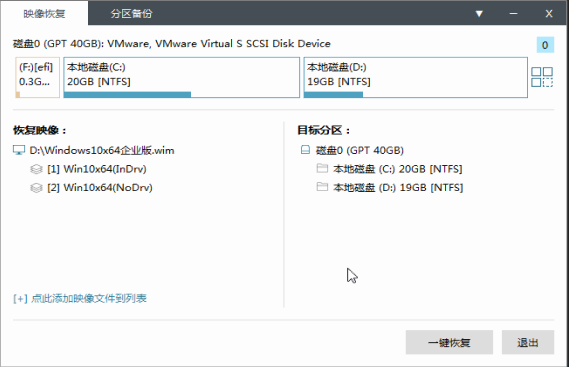
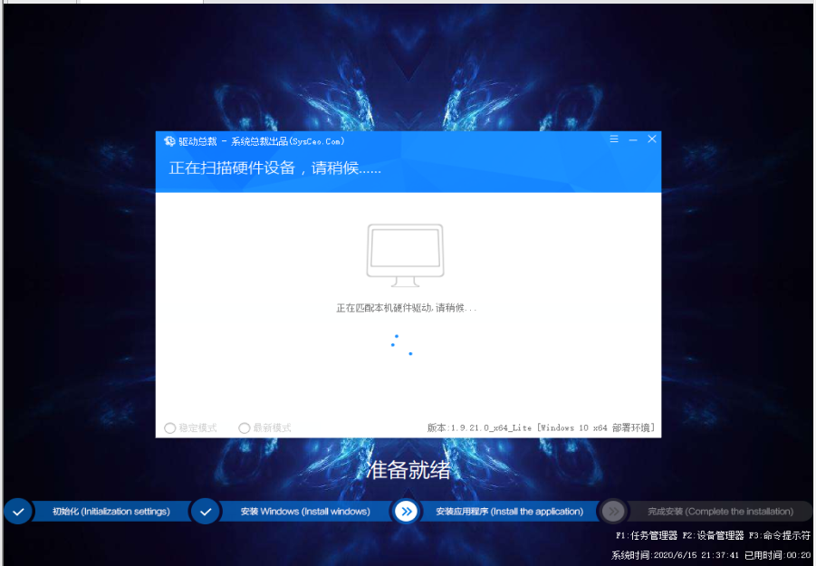
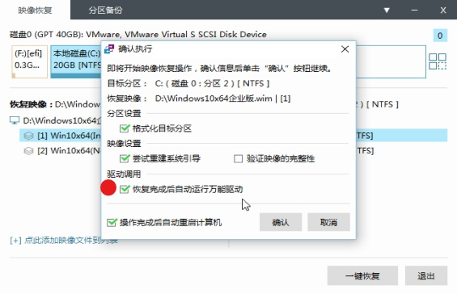
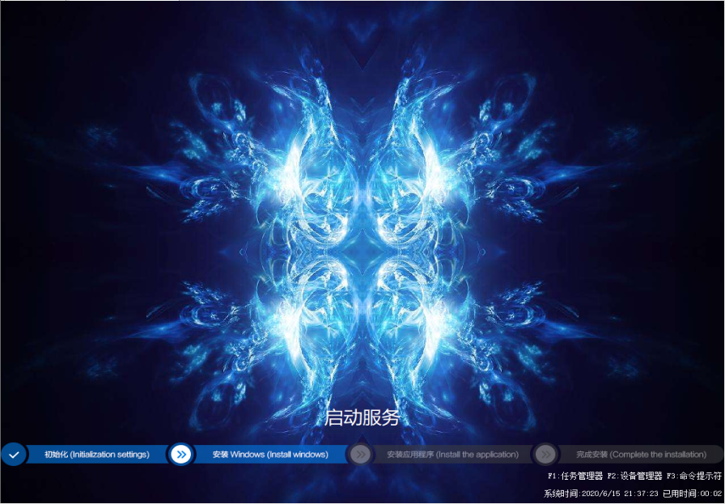
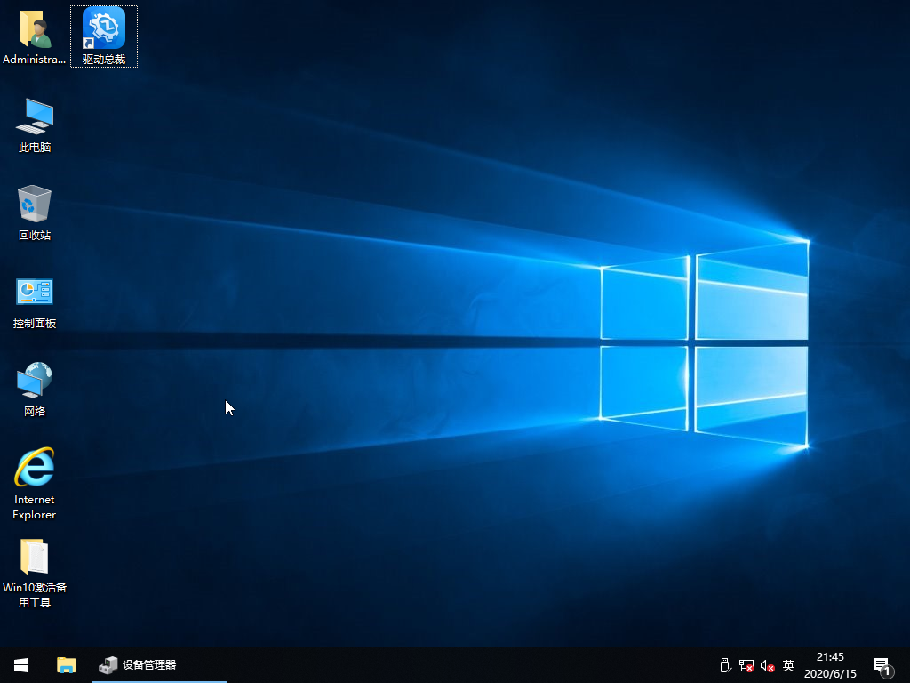
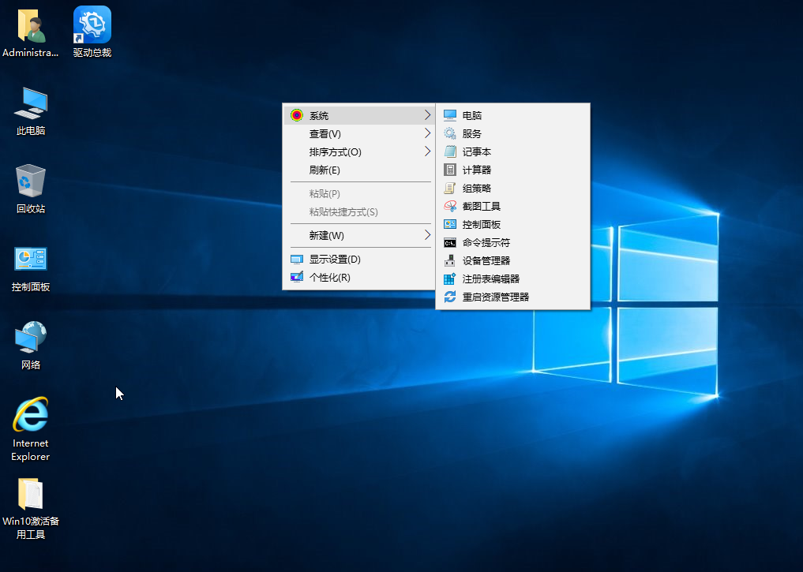

# Win10系统镜像说明

## 下载地址

链接：[https://pan.baidu.com/s/125bau1znZVJGe1K0isSB0A](https://pan.baidu.com/s/125bau1znZVJGe1K0isSB0A) 
提取码: emcg

## 注意事项

### 1\. Win10x64 \(InDrv\) 带驱动版本

该镜像内置**系统总裁**驱动包，驱动版本：\[1\.9\.21\.0\]
安装过程会自动加载驱动总裁适配硬件。

### 2\. Win10x64 \(NoDrv\) 无纯净驱动版

不含内置驱动，推荐搭配**优启通 PE**离线注入驱动
教程地址：[https://www\.itsk\.com/thread\-408656\-1\-1](https://www.itsk.com/thread-408656-1-1)

## 系统安装流程截图

### 1. 系统部署中

### 2. 进入桌面

## 右键菜单增强

系统右键内置快捷入口：服务、组策略、设备管理器，简化运维操作

## 版权说明

感谢 IT 天空、系统总裁相关项目支持。
若内容 / 软件涉及侵权，请联系作者删除。
邮箱：[admin@mocos\.cn](mailto:admin@mocos.cn)
QQ：1474922147

Copyright © 2017\-2026\[魔客室\] All rights reserved\.
